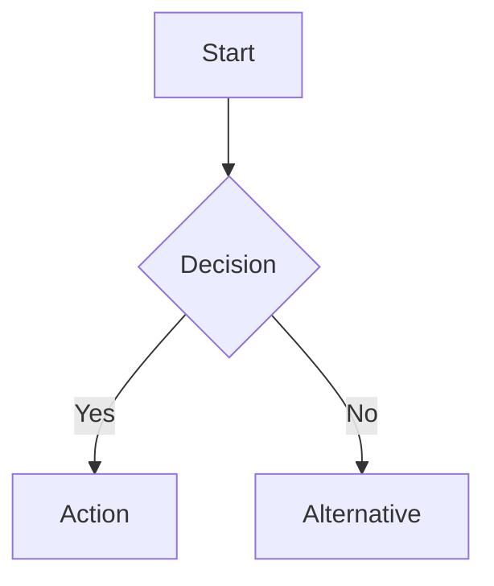

Create diagrams using Mermaid (preferred) or PlantUML. Output goes into Markdown sources so it stays reviewable in diff.

## Tool priority

1. **Mermaid inline in Markdown** — default. GitHub, VS Code, Obsidian render it automatically; diagram source lives in the same file as the prose that references it.
2. **mermaid-cli (`mmdc`)** — when PNG / SVG / PDF export is needed (presentations, external docs). Installed via `brew "mermaid-cli"`.
3. **PlantUML** — when UML-specific semantics are required and Mermaid can't express them cleanly. Install with `brew install plantuml`.
4. **draw.io XML** — only when none of the above is expressive enough. Edit in VS Code's `hediet.vscode-drawio` extension; the repo does not run a drawio MCP.

## Decision tree

| Diagram type | Recommended tool |
|---|---|
| Flowchart / decision tree | Mermaid `graph` / `flowchart` |
| Sequence / interaction | Mermaid `sequenceDiagram` |
| State machine | Mermaid `stateDiagram-v2` |
| ER diagram / class diagram | Mermaid `erDiagram` / `classDiagram` |
| Org chart / mindmap | Mermaid `mindmap` |
| Timeline / gantt | Mermaid `timeline` / `gantt` |
| Git branch visualization | Mermaid `gitgraph` |
| Architecture / network topology | Mermaid flowchart first; draw.io XML only if layout needs exceed Mermaid's capability |
| UML-specific (activity, component) | PlantUML |

## Inline Mermaid pattern (preferred)

````markdown

````

Supported diagram types: `graph` / `flowchart`, `sequenceDiagram`, `classDiagram`, `stateDiagram-v2`, `erDiagram`, `gantt`, `pie`, `mindmap`, `timeline`, `gitgraph`.

## Rendering to PNG / SVG / PDF

```bash
mmdc -i docs/diagrams/flow.mmd -o docs/diagrams/flow.svg
mmdc -i docs/diagrams/flow.mmd -o docs/diagrams/flow.png -w 1600 -H 900
mmdc -i docs/diagrams/flow.mmd -o docs/diagrams/flow.pdf
```

Keep the `.mmd` source alongside the rendered output so diagrams stay reviewable as code.

## Design principles

- **Readable at a glance**: clear labels, consistent font size.
- **Left-to-right or top-to-bottom**: follow natural reading flow.
- **Color with purpose**: use color to group or highlight, not decorate.
- **Minimize crossing lines**: rearrange nodes to reduce visual clutter.
- **Legend when needed**: if colors/shapes have meaning, add a legend.
- **Text diff friendly**: prefer formats that live in version control (Mermaid, PlantUML) over binary (drawio, visio).

## Output conventions

- Inline diagrams: embed directly in the `.md` file that references them.
- Standalone sources: `docs/diagrams/*.mmd` (or `.puml`).
- Rendered images: `docs/diagrams/*.svg` or `*.png` sitting next to the source.

$ARGUMENTS
