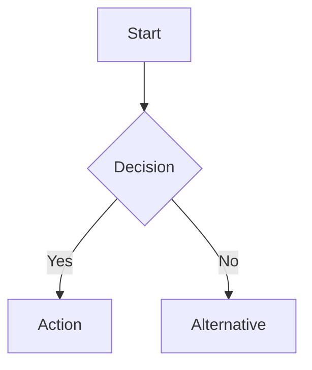

Create diagrams and visualizations using draw.io MCP, Mermaid, or PlantUML.

## Available tools

### draw.io MCP (preferred for complex diagrams)
- `mcp__drawio__open_drawio_mermaid` — render Mermaid syntax in draw.io
- `mcp__drawio__open_drawio_xml` — render draw.io XML directly
- `mcp__drawio__open_drawio_csv` — render CSV data as diagrams

### Mermaid (inline, no external tools)
Generates text-based diagrams embeddable in Markdown.

### PlantUML (for UML-specific diagrams)
Requires PlantUML installed (`brew install plantuml`).

## Decision tree
| Diagram type | Recommended tool |
|---|---|
| Architecture / system design | draw.io XML |
| Flowchart / sequence / state | Mermaid → draw.io MCP |
| ER diagram / class diagram | Mermaid or PlantUML |
| Network topology | draw.io XML |
| Org chart / mindmap | draw.io CSV or Mermaid |
| Quick inline (README, docs) | Mermaid (no render needed) |
| Complex custom layout | draw.io XML |

## Workflow
1. **Clarify the purpose**: what the diagram explains, who reads it, where it lives.
2. **Choose the tool** based on the decision tree above.
3. **Draft the diagram** in the chosen format.
4. **Render and verify**: use draw.io MCP to open and inspect visually.
5. **Iterate**: adjust layout, labels, colors until clear.

## Mermaid patterns


Supported types: `graph`, `sequenceDiagram`, `classDiagram`, `stateDiagram-v2`, `erDiagram`, `gantt`, `pie`, `flowchart`, `mindmap`, `timeline`, `gitgraph`.

## draw.io XML tips
- Use `mxGraphModel` as root element.
- Each cell needs a unique `id`. Use `id="1"`, `id="2"`, etc.
- Edges reference `source` and `target` by cell id.
- Use `style` attribute for colors, shapes, fonts.
- Common shapes: `rounded=1` (rounded rect), `ellipse`, `rhombus`, `shape=mxgraph.flowchart.*`.

## draw.io CSV format
For data-driven diagrams (org charts, hierarchies):
```csv
## label: %name%
## style: shape=%shape%;fillColor=%fill%
## connect: {"from": "manager", "to": "name", "style": "curved=1;"}
## width: 120
## height: 40
name,manager,shape,fill
CEO,,ellipse,#dae8fc
CTO,CEO,rounded,#d5e8d4
Engineer,CTO,rounded,#fff2cc
```

## Design principles
- **Readable at a glance**: clear labels, consistent font size.
- **Left-to-right or top-to-bottom**: follow natural reading flow.
- **Color with purpose**: use color to group or highlight, not decorate.
- **Minimize crossing lines**: rearrange nodes to reduce visual clutter.
- **Legend when needed**: if colors/shapes have meaning, add a legend.

## Output conventions
- Write final diagrams under `output/diagrams/`.
- Save source files (`.mmd`, `.puml`, `.drawio`) alongside rendered output.

$ARGUMENTS
